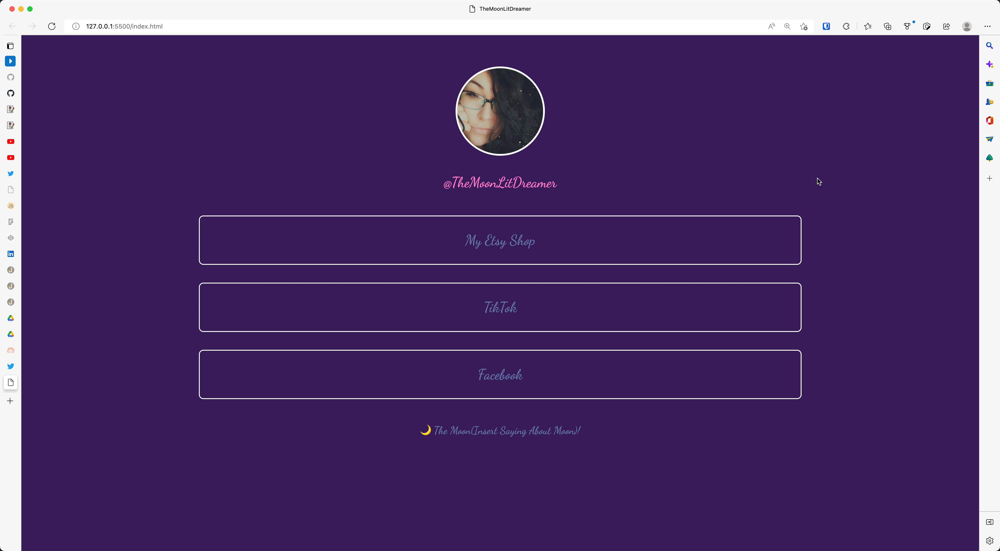

In this project we created a LinkTree Alternative for a client who needed an Instgram landing page to drive sales and social media connections. The project helped me learn how to design and implement a responsive web site. 

In this project I gained experience with front-end web application design and associated technologies, including the [Twitter Bootstrap](http://getbootstrap.com/) CSS Framework for the user interface, and Javascript for both client and server-side programming. 

 
Source: <a href="https://github.com/theVacay/vacay">theVacay/vacay</a>
